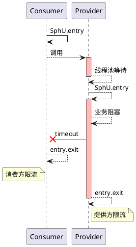
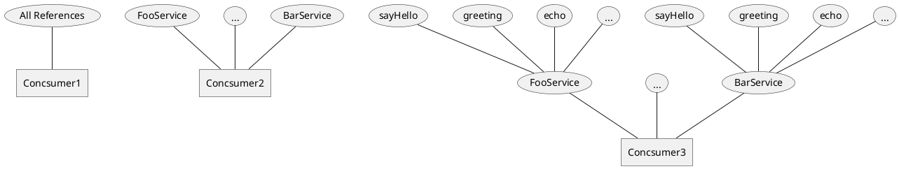
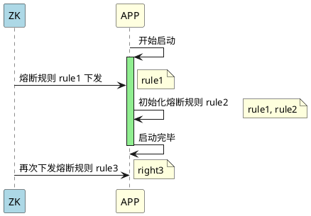

```plantuml
@startuml
Consumer -> Consumer: SphU.entry
Consumer --> Provider: 调用
activate Provider #FFBBBB
Provider --> Provider: 线程池等待
deactivate Provider
Provider --> Provider: SphU.entry
activate Provider #FFBBBB
Provider --> Provider: 业务阻塞
Provider -[#red]>x Consumer : timeout
Consumer --> Consumer: entry.exit
note left of Consumer: 消费方限流
Provider --> Provider: entry.exit
deactivate Provider
note right of Provider: 提供方限流
@enduml

```

```plantuml
@startchen
entity Concsumer1 {
  All References
}

entity Concsumer2 {
  FooService
  ...
  BarService
}

entity Concsumer3 {
  FooService {
    sayHello
    greeting
    echo
    ...
  }
  ...
  BarService {
    sayHello
    greeting
    echo
    ...
  }
}
@endchen
```

```plantuml
@startuml
participant ZK #lightblue
participant APP #lightyellow

APP -> APP: 开始启动
activate APP #lightgreen
ZK -> APP: 熔断规则 rule1 下发
note right: rule1
APP -> APP: 初始化熔断规则 rule2
note right: rule1, rule2
APP -> APP: 启动完毕
deactivate APP

ZK -> APP: 再次下发熔断规则 rule3
note right: right3


@enduml
```

