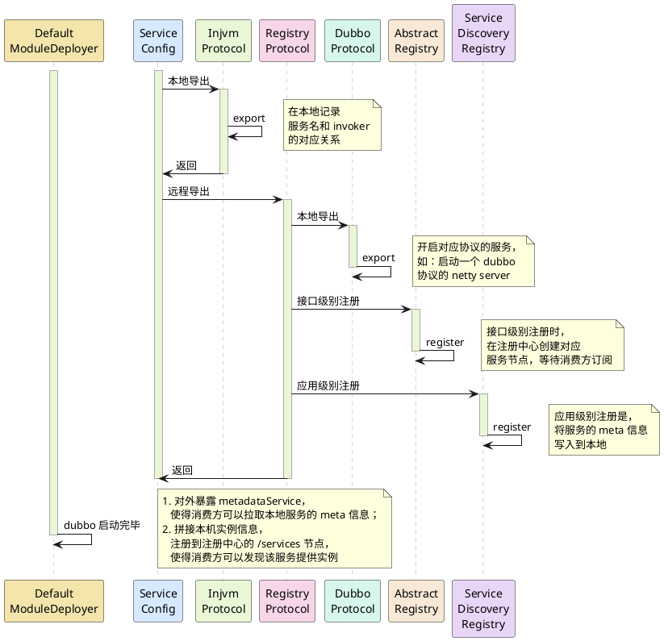

相关 `prompt`：
```
使用 plantuml 语法为我生成以下顺序的时序图：
- DefaultModuleDeployer 节点开始一个生命线
- ServiceConfig 节点开始一个生命线
- ServiceConfig 节点请求 InjvmProtocol 节点，请求内容为：本地导出
- InjvmProtocol 节点请求自身，请求内容为：export 
- 在右侧生成一个备注：在本地记录服务名和 invoker 的对应关系
- InjvmProtocol 节点返回到 ServiceConfig 节点，使用虚线
- ServiceConfig 节点请求 RegistryProtocol 节点，请求内容为：远程导出
- RegistryProtocol 节点调用 DubboProtocol 节点，请求内容为：本地导出
- DubboProtocol 节点调用自身，请求内容为：export
- 在右侧生成一个备注：开启对应协议的服务，如：启动一个 dubbo 协议的 netty server
- RegistryProtocol 节点调用 AbstractRegistry 节点，请求内容为：接口级别注册
- AbstractRegistry 节点调用自身，请求内容为：register
- 在右侧生成一个备注：接口级别注册时，在注册中心创建对应服务节点，等待消费方订阅
- RegistryProtocol 节点调用 ServiceDiscoveryRegistry 节点，请求内容为：应用级别注册
- ServiceDiscoveryRegistry 节点调用自身，请求内容为：register
- 在右侧生成一个备注：应用级别注册是，将服务的 meta 信息写入到本地
- RegistryProtocol 节点返回到 ServiceConfig 节点，使用虚线
- DefaultModuleDeployer 节点请求自身，请求内容为：dubbo 启动完毕
- 在右侧生成一个备注：1，对外暴露 metadataService，使得消费方可以拉取本地服务的 meta 信息；2，拼接本机实例信息，注册到注册中心的 /services 节点，使得消费方可以发现该服务提供实例


其他的提示：
- 使用 activate, deactivate 关键词开启、关闭生命线
- 每个节点使用不同的柔和的颜色进行背景，注意不要使用红色相关的颜色
- 如果备注中内容长于 20 个字，则换行展示
```