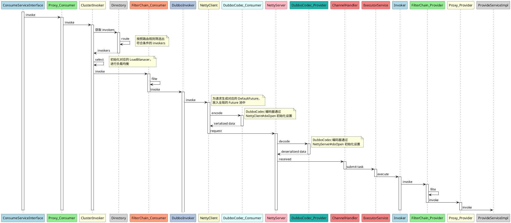
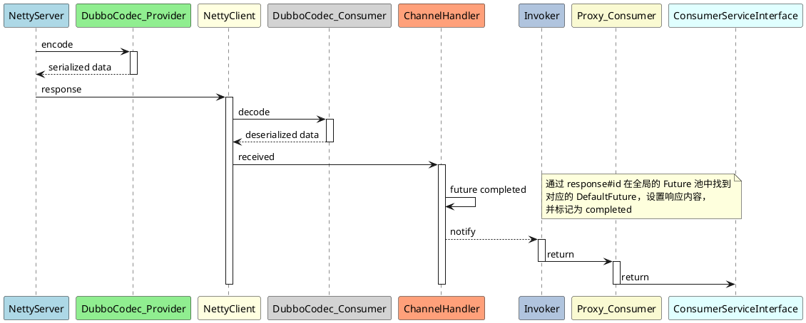

相关 `prompt`：
```
使用 plantuml 语法为我生成以下顺序的时序图：
- ConsumeServiceInterface 节点开始一个生命线
- ConsumeServiceInterface 节点请求 Proxy 节点，请求内容为：invoke
- Proxy(Consumer) 节点请求 ClusterInvoker 节点，请求内容为：invoke
- ClusterInvoker 节点请求 Directory 节点，请求内容为：获取 invokers
- Directory 节点请求自身，请求内容为：route
- 在右侧生成一个备注：按照路由规则筛选出符合条件的 invokers
- Directory 节点返回给 ClusterInvoker 节点，返回内容为：invokers
- ClusterInvoker 节点请求自身，请求内容为：select
- 在右侧生成一个备注：初始化对应的 LoadBlanacer，进行负载均衡
- ClusterInvoker 节点请求 FilterChain 节点，请求内容为：invoke
- FilerChain(Consumer) 节点请求自身，请求内容为：filte
- FilerChain(Consumer) 节点请求 DubboInvoker 节点，请求内容为：invoke
- DubboInvoker 节点请求 NettyClient 节点，请求内容为：invoke
- 在右侧生成一个备注：为请求生成对应的 DefaultFuture，放入全局的 Future 池中
- NettyClient 节点请求 DubboCodec(Consumer) 节点，请求内容为：encode
- 在右侧生成一个备注：DubboCodec 编码器通过 NettyClient#doOpen 初始化设置
- DubboCodec(Consumer)节点返回到 NettyClient 节点，返回内容为：serialized data
- NettyClient 节点请求 NettyServer 节点，请求内容为：request
- NettyServer 节点请求 DubboCodec(Provider) 节点，请求内容为：decode
- 在右侧生成一个备注：DubboCodec 编码器通过 NettyServer#doOpen 初始化设置
- DubboCodec(Provider) 节点返回到 NettyServer 节点，返回内容为：deserialized data
- NettyServer 节点请求 ChannelHandler 节点，请求内容为：received
- ChannelHandler 节点请求 ExecutorService 节点，请求内容为：submit task
- ExecutorService 节点异步请求 Invoker 节点，请求内容为：execute
- Invoker 节点请求 FilerChain(Provider)节点，请求内容为：invoke
- FilerChain(Provider)节点请求自身，请求内容为：filte
- FilerChain(Provider)节点请求 Proxy(Provider)节点，请求内容为：invoke
- Proxy(Provider)节点请求 ProvideServiceImpl 节点，请求内容为：invoke

其他的提示：
- 使用 activate, deactivate 关键词开启、关闭生命线
- 每个节点使用不同的柔和的颜色进行背景，注意不要使用红色相关的颜色
- 如果备注中内容长于 20 个字，则换行展示
```



```
使用 plantuml 语法为我生成以下顺序的时序图：
- NettyServer 节点请求 DubboCodec(Provider) 节点，请求内容为：encode
- DubboCodec(Provider) 节点返回到 NettyServer 节点，返回内容为：serialized data
- NettyServer 节点请求 NettyClient 节点，请求内容为：response
- NettyClient 节点请求 DubboCodec(Consumer)节点，请求内容为：decode
- DubboCodec(Consumer)节点返回到 NettyClient 节点，返回内容为：deserialized data
- NettyClient 节点请求 ChannelHandler 节点，请求内容为：received
- ChannelHandler 节点请求自身，请求内容为：future completed
- 在右侧生成一个备注：通过 response#id 在全局的 Future 池中找到对应的 DefaultFuture，设置响应内容，并标记为 completed
- ChannelHandler 节点请求 Invoker 节点，使用虚线，请求内容为：notify
- Invoker 节点请求 Proxy(Consumer) 节点，请求内容为：return
- Proxy(Consumer) 节点请求 ConsumerServiceInterface 节点，请求内容为：return

其他的提示：
- 使用 activate, deactivate 关键词开启、关闭生命线
- 每个节点使用不同的柔和的颜色进行背景，注意不要使用红色相关的颜色
- 如果备注中内容长于 20 个字，则换行展示
```