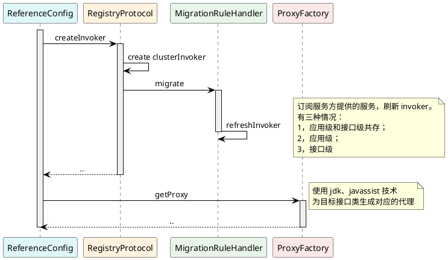
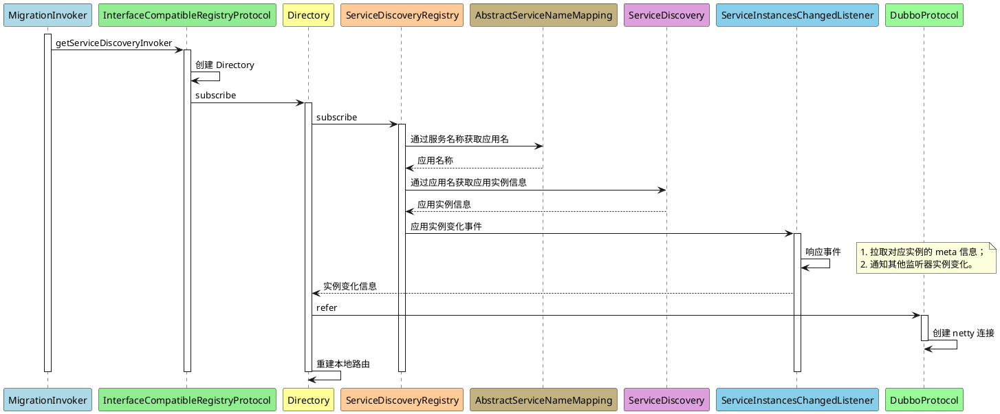

相关 `prompt`:
```
使用 plantuml 语法为我生成以下顺序的时序图：
- ReferenceConfig 节点开始一个生命线
- ReferenceConfig 节点请求 RegistryProtocol 节点，请求内容为：createInvoker
- RegistryProtocol 节点请求本身，请求内容为：创建 clusterInvoker
- RegistryProtocol 节点请求 MigrationRuleHandler 节点，请求内容为：migrate
- MigrationRuleHandler 节点请求本身，请求内容为：refreshInvoker
- 在右侧生成一个备注：订阅服务方提供的服务，刷新 invoker。有三种情况1，应用级和接口级共存；2，应用级；3，接口级
- RegistryProtocol 节点返回到 ReferenceConfig 节点，使用虚线
- ReferenceConfig 节点请求 ProxyFactory 节点，请求内容为：getProxy
- 在右侧生成一个备注：使用 jdk、javassist 技术为目标接口类生成对应的代理
- ProxyFactory 节点返回到 ReferenceConfig 节点，使用虚线
- 关闭 ReferenceConfig 节点的生命线

其他的提示：
- 使用 activate, deactivate 关键词开启、关闭生命线
- 每个节点使用不同的柔和的颜色进行背景，注意不要使用红色相关的颜色
- 如果备注中内容长于 20 个字，则换行展示
- 不要使用 `actor` 关键字来初始化节点
```



相关 `prompt`：
```
使用 plantuml 语法为我生成以下顺序的时序图：
- MigrationInvoker 节点开始一个生命线
- MigrationInvoker 节点请求 InterfaceCompatibleRegistryProtocol 节点，请求内容为：getServiceDiscoveryInvoker
- InterfaceCompatibleRegistryProtocol 节点请求自身，请求内容为：创建 Directory
- InterfaceCompatibleRegistryProtocol 节点请求 Directory 节点，请求内容为：subscribe
- Directory 节点请求 ServiceDiscoveryRegistry 节点，请求内容为：subscribe
- ServiceDiscoveryRegistry 节点请求 AbstractServiceNameMapping 节点，请求内容为：通过服务名称获取应用名
- AbstractServiceNameMapping 节点返回到 ServiceDiscoveryRegistry 节点，返回内容为：应用名称
- ServiceDiscoveryRegistry 节点请求 ServiceDiscovery 节点，请求内容为：通过应用名获取应用实例信息
- ServiceDiscovery 节点返回到 ServiceDiscoveryRegistry 节点，返回内容为：应用实例信息
- ServiceDiscoveryRegistry 节点请求 ServiceInstancesChangedListener 节点，请求内容为：应用实例变化事件
- ServiceInstancesChangedListener 节点请求自身，请求内容为：响应事件
- 在右侧生成一个备注：1，拉取对应实例的 meta 信息；2，通知其他监听器实例变化
- ServiceInstancesChangedListener 节点返回到 Directory 节点，请求内容为：实例变化信息
- Directory 节点请求 DubboProtocol 节点，请求内容为：refer
- DubboProtocol 节点请求自身，请求内容为：创建 netty 连接
- Directory 节点请求自身，请求内容为：重建本地路由

其他的提示：
- 使用 activate, deactivate 关键词开启、关闭生命线
- 每个节点使用不同的柔和的颜色进行背景，注意不要使用红色相关的颜色
- 如果备注中内容长于 20 个字，则换行展示
```