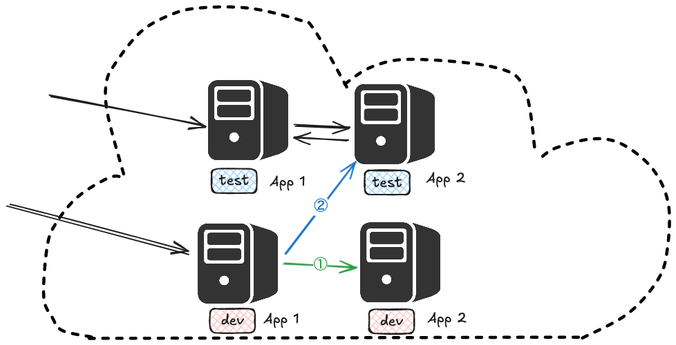

# dubbo 相关原理

## 注册中心相关路径


- /services 应用实例的注册空间
- /dubbo/mapping 服务类与应用名称的映射空间
- /dubbo/config 配置空间
- /dubbo/metadata 元信息空间
## 注册流程


## 引用流程


## 调用 & 处理流程


### dubbo 协议


|偏移量（位）|含义|备注|
|---|---|---|
|0~7|魔数高位|0xda00|
|8~15|魔数低位|0xbb|
|16|消息类型|0：响应；1：请求|
|17|调用方式|0：单向调用；1：双向调用（只在第 16 位为 1 时有效）|
|18|事件类型|0：请求/响应数据；1：心跳|
|19~23|序列化器编号|标记采用哪种序列化器对消息序列化|
|24~31|状态|调用成功、客户端超时、服务端超时等调用结果状态|
|32~95|请求编号|用于将来响应消息时，定位请求|
|96~127|数据长度|运行时计算得出，本次消息的数据长度|
|128~|消息体|动态长度，请求/响应的数据|
# dubbo + sentinel


# dubbo admin

## 服务发现


## 服务测试

```java
ReferenceConfig<GenericService> reference = new ReferenceConfig<>();  
reference.setGeneric("true");  
reference.setInterface(Tool.getInterface(service));  
reference.setVersion(Tool.getVersion(service));  
reference.setGroup(Tool.getGroup(service));  
reference.setSticky(false);  
  
DubboBootstrap dubboBootstrap = DubboBootstrap.getInstance()  
        .application(applicationConfig)  
        .protocol(protocolConfig)  
        .registry(registryConfig)  
        .reference(reference)  
        .start();  
try {  
    removeGenericSymbol(parameterTypes);  
    GenericService genericService = dubboBootstrap.getCache().get(reference);  
    return genericService.$invoke(method, parameterTypes, params);  
} finally {  
    reference.destroy();  
}
```
## 路由配置

使用 `ktcl` 工具连接到测试环境 k8s 网络，使其能够访问测试环境应用


测试环境服务只访问测试环境服务
```json
enabled: true
runtime: false
force: true
conditions:
 - 'host = 172.* => host = 172.*'
```


开发环境服务首先访问开发环境服务，如果访问不通则再次访问测试环境服务
```json
enabled: true
runtime: false
force: false
conditions:
 - 'host = 192.* => host = 192.*'
```

# dubbo 监控

