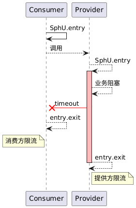
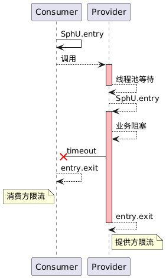
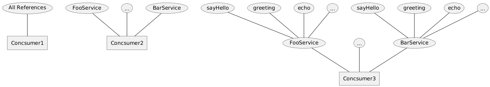
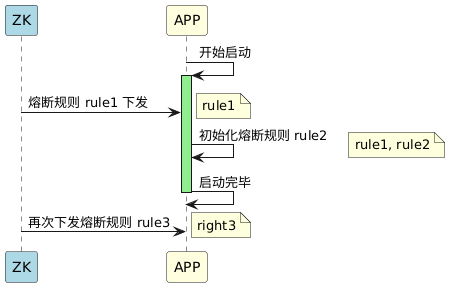

# 背景

使用 dubbo 作为微服务的 rpc 工具，存在下游服务提供方故障时，调用方长时间等待，导致调用方也无法对外提供服务的可能（可能原因：dubbo 线程池耗尽），这种一般称之为级联故障。

dubbo 官网中提供了[案例](https://cn.dubbo.apache.org/zh/blog/2018/07/27/sentinel-%E4%B8%BA-dubbo-%E6%9C%8D%E5%8A%A1%E4%BF%9D%E9%A9%BE%E6%8A%A4%E8%88%AA/)，dubbo 和 sentinel 很好的衔接，以进行熔断处理，提升服务的稳定性。

# 实现原理

如同其他 sentinel adapter 实现原理类似，基于目标框架的 Filter / Interceptor 等机制，实现对应的 Filter / Interceptor 用于拦截所有请求，然后在请求开始前进行 Sentinel 的限流、熔断操作。

需要强调的是，当 dubbo 线程池满了的时候，后续的 RPC 请求会在线程池的等待队列中等待，此时 Filter 不会被执行。另外 Sentinel 的熔断需要统计数据支持，只有当业务代码执行完毕退出 Sentinel 资源时，才会统计方法执行的 RT、异常数等情况。

官方提供的 `sentinel-dubbo-adapter` 实现中，提供了两个 Filter 实现：`SentinelDubboConsumerFilter`、`SentinelDubboProviderFilter`，分别用于提供方和消费方的限流。它们实现基本相同，只不过生效时机不同，具体请见下面代码：

```java
// 该 filter 只会对调用方提供服务时被激活
@Activate(group = PROVIDER)  
public class SentinelDubboProviderFilter extends AbstractDubboFilter implements Filter {  
  
    @Override  
    public Result invoke(Invoker<?> invoker, Invocation invocation) throws RpcException {  
        // Get origin caller.  
        String origin = DubboAdapterGlobalConfig.getOriginParser().parse(invoker, invocation);  
        // ...
        
        try {  
            String prefix = DubboAdapterGlobalConfig.getDubboProviderPrefix();  
            // 服务的方法名，如：com.example.FooServiceImpl:sayHello(java.lang.String)
            String methodResourceName = getMethodResourceName(invoker, invocation, prefix);  
            // 服务的接口名，如：com.example.FooServiceImpl
            String interfaceName = getInterfaceName(invoker, prefix);  
            ContextUtil.enter(methodResourceName, origin);  
            // 基于服务方法名进行限流、熔断等检查，流量 +1
            // EntryType.IN 代表该流量是流入的，当系统故障时，会阻塞该请求
            interfaceEntry = SphU.entry(interfaceName, ResourceTypeConstants.COMMON_RPC, EntryType.IN);  
            // 基于服务接口名进行限流、熔断等检查
            methodEntry = SphU.entry(methodResourceName, ResourceTypeConstants.COMMON_RPC,  
                EntryType.IN, invocation.getArguments());  
  
            Result result = invoker.invoke(invocation);  
            if (result.hasException()) {  
                Throwable e = result.getException();  
                // Record common exception.  
                Tracer.traceEntry(e, interfaceEntry);  
                Tracer.traceEntry(e, methodEntry);  
            }  
            return result;  
        } 
        // ...
        } finally {  
	        // 退出方法、接口资源，此时会统计资源的 rt、异常等值
		    if (methodEntry != null) {  
		        methodEntry.exit(1, invocation.getArguments());  
		    }  
		    if (interfaceEntry != null) {  
		        interfaceEntry.exit();  
		    }  
		}
    }  
}

// 该 filter 只会在调用其他服务时激活
@Activate(group = CONSUMER)  
public class SentinelDubboConsumerFilter extends AbstractDubboFilter implements Filter {  
  
    @Override  
    public Result invoke(Invoker<?> invoker, Invocation invocation) throws RpcException {  
	        // ...
	        // EntryType.OUT 代表该流量是流出的
            interfaceEntry = SphU.entry(interfaceResourceName, ResourceTypeConstants.COMMON_RPC, EntryType.OUT);  
            methodEntry = SphU.entry(methodResourceName, ResourceTypeConstants.COMMON_RPC,  
                EntryType.OUT, invocation.getArguments());  
			  //...
}
```

最后是是通过 dubbo 的 SPI 机制注册上述 Filter
```
- META-INF
	- dubbo
		- com.alibaba.dubbo.rpc.Filter


`com.alibaba.dubbo.rpc.Filter` 文件内容：
sentinel.dubbo.provider.filter=com.alibaba.csp.sentinel.adapter.dubbo.SentinelDubboProviderFilter  sentinel.dubbo.consumer.filter=com.alibaba.csp.sentinel.adapter.dubbo.SentinelDubboConsumerFilter  dubbo.application.context.name.filter=com.alibaba.csp.sentinel.adapter.dubbo.DubboAppContextFilter
```

# 实际操作

接入了 `sentinel-dubbo-adapter` 组件后，使得我们服务具备对 dubbo RPC 请求进行限流、熔断的能力。下一步还需要按照我们系统实际情况，为其配置对应的熔断规则（这不是一个容易的事）。

## 在哪端进行熔断
接口的响应时长、调用频率不同，为其配置的熔断规则应该有所不同。我们来看以下几种情况：

1，接口提供方快速失败
当调用的接口快速失败时，熔断作用没那么大，配在消费方或提供方区别不大

2，接口响应慢
此时在消费方配置熔断规则，生效速度会比在提供方配置快



3，接口响应慢，并且调用频率高
如果接口响应慢，并且调用频率高，则可能会耗尽服务提供方的 dubbo 线程池，从而导致后续请求会在阻塞队列中等待。此时提供方的熔断规则生效时长会更慢



综合以上讨论，在服务消费方设置熔断规则比在服务提供方设置规则要好一些
## 熔断的范围

dubbo 熔断规则支持三种维度：
- 应用级别（默认降级熔断规则）
- 接口级别（如：`com.example.FooServiceImpl:sayHello`）
- 方法级别（如：`com.example.FooServiceImpl:sayHello(java.lang.String)`）

它们之间的区别主要是颗粒度不同，影响范围不一样：



如果服务提供方部分故障时，应用级别的熔断会使得消费方熔断所有外部请求，造成消费方无法对外提供服务。如果服务提供方全局故障时，方法级别的熔断会浪费很多次消费方请求。所以综合来说，使用接口级别进行熔断较为合理。

人才微服务的 Sentienl 熔断规则初始化如下：
```java
@Configuration  
public class SentinelConfig implements ApplicationListener<ApplicationReadyEvent> {  
  
    @Override  
    public void onApplicationEvent(ApplicationReadyEvent applicationReadyEvent) {  
        initCircuitBreakerRule();  
        initSentinelEventObserver();  
    }  
  
    private void initCircuitBreakerRule() {  
	    // 获取依赖的所有服务数据
        Collection<ConsumerModel> consumerModels = ApplicationModel.defaultModel()  
                .getApplicationServiceRepository()  
                .allConsumerModels();  
  
        for (ConsumerModel consumerModel : consumerModels) {  
	        // 慢调用比例熔断
            DegradeRule slowRatioDegradeRule = new DegradeRule(consumerModel.getServiceModel().getInterfaceName())  
                    .setCount(2_000)        
                .setGrade(CircuitBreakerStrategy.SLOW_REQUEST_RATIO.getType())
                    .setSlowRatioThreshold(0.7)     
                    .setStatIntervalMs(10_000)     
                    .setTimeWindow(5)        
                    .setMinRequestAmount(10);   
            // 异常比例熔断    
            DegradeRule exceptionRatioDegradeRule = new DegradeRule(consumerModel.getServiceModel().getInterfaceName())  
                    .setCount(0.7)             
                    .setGrade(CircuitBreakerStrategy.ERROR_RATIO.getType()) 
                    .setStatIntervalMs(10_000)   
                    .setTimeWindow(5)       
                    .setMinRequestAmount(10);            
  
            DegradeRuleManager.setRulesForResource(consumerModel.getServiceModel().getInterfaceName(), Sets.newHashSet(slowRatioDegradeRule, exceptionRatioDegradeRule));  
        }  
    }  
  
    private void initSentinelEventObserver() {  
        EventObserverRegistry.getInstance().addStateChangeObserver("defaultObserver", new MyCircuitBreakerStateChangeObserver());  
    }   
  
    /**  
     * 熔断状态变更观察者  
     */  
    class MyCircuitBreakerStateChangeObserver implements CircuitBreakerStateChangeObserver {  
  
        @Override  
        public void onStateChange(CircuitBreaker.State prevState, CircuitBreaker.State newState,  
                                  DegradeRule degradeRule, Double snapshotValue) {  
            
	    // 发生熔断或退出熔断时，进行企微通知
    }  
}
```

其与外部数据源搭配使用的时候，熔断规则生效顺序如下：

1. 启动时从 zk 读取配置规则 rule1
2. 启动完毕后加载规则 rule2，项目中会有规则 rule1 + rule2
3. 运行时从 zk 加载规则 rule3，会将原先的规则清空，只保留 rule3