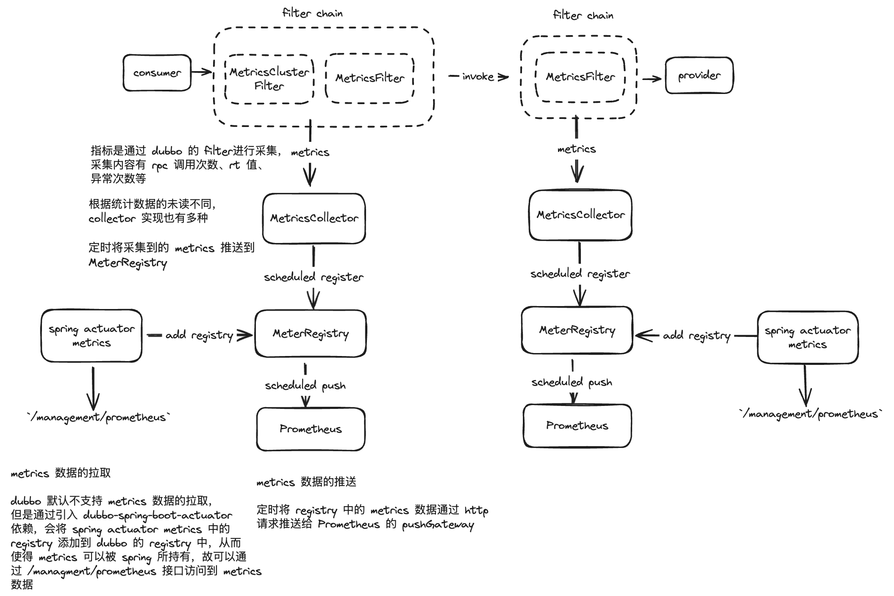
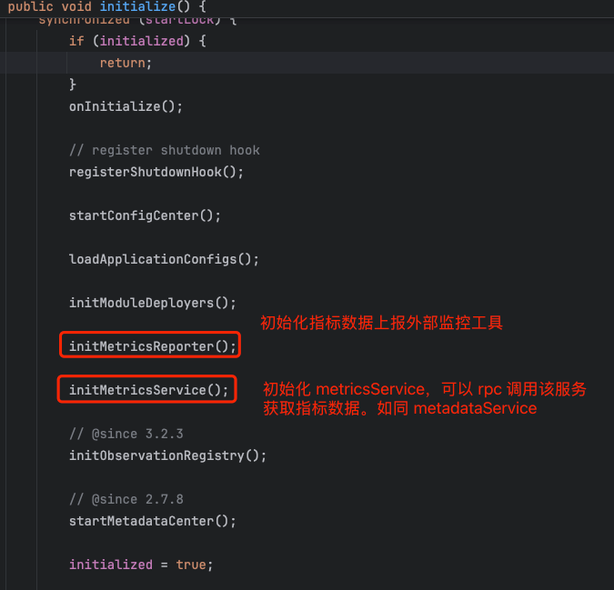
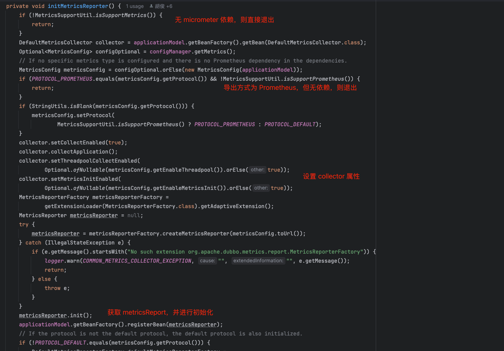
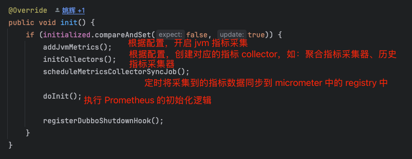
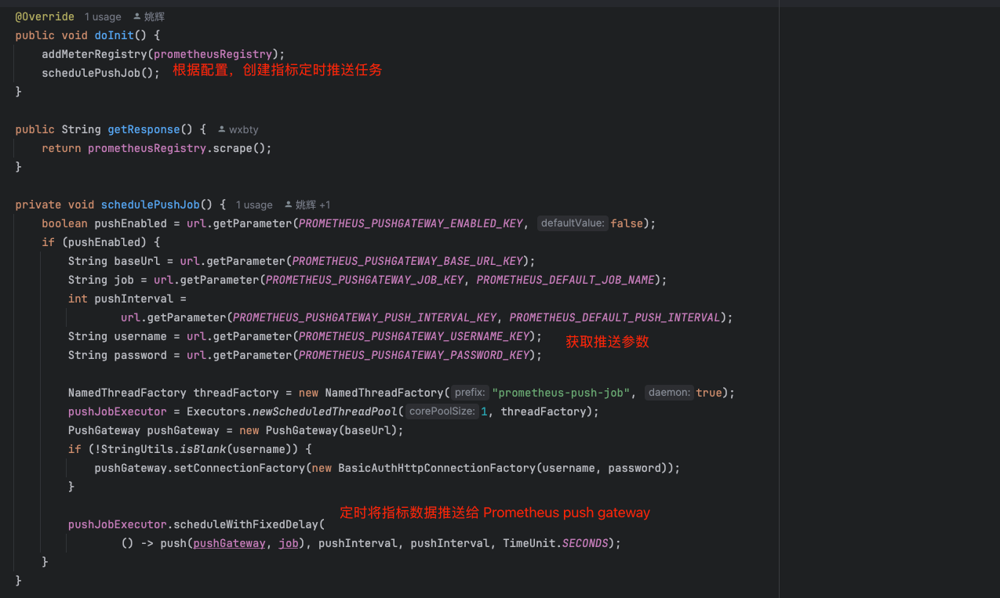
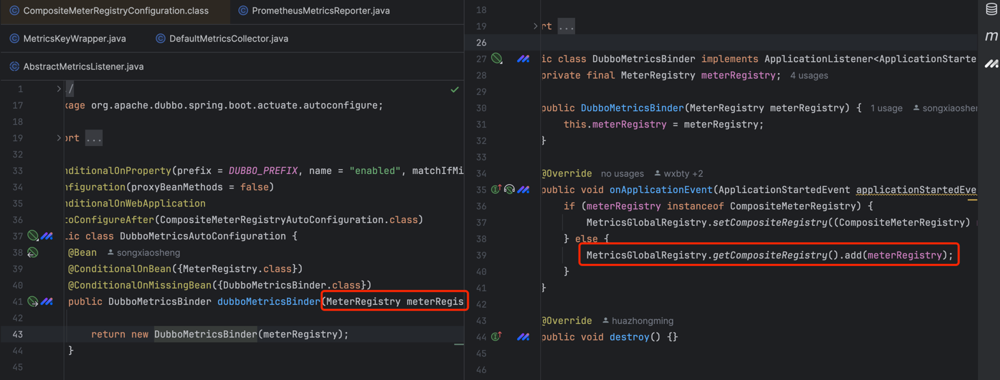
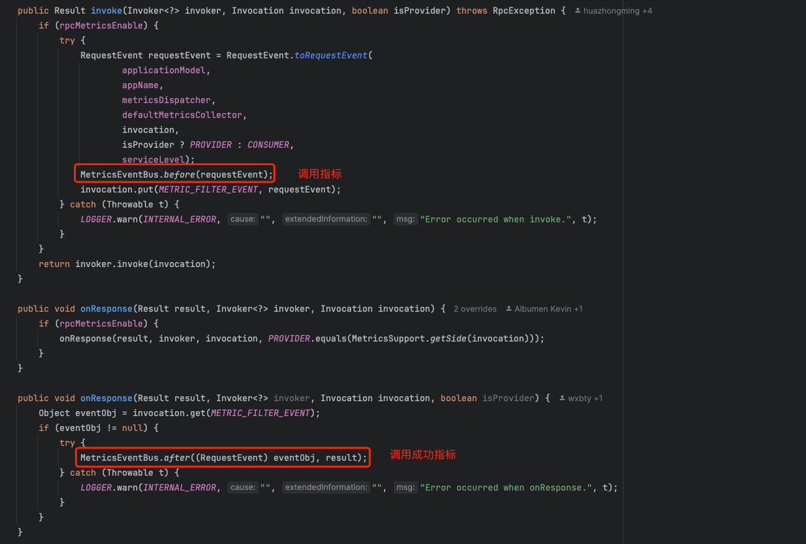
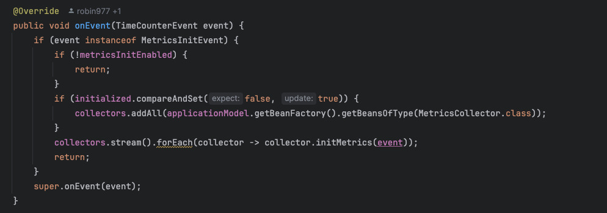
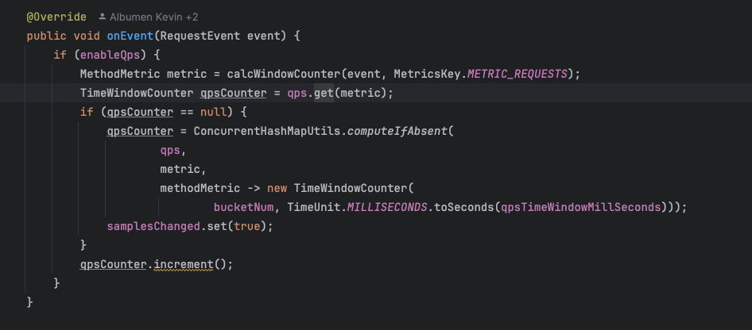

# dubbo 如何上报指标数据到 Prometheus

应用启动后初始化指标上报逻辑

我们以 PrometheusMetricsReporter 为例，其实现了 MetricsReporter 接口，用于将指标数据上报到 Prometheus 中。

# Prometheus 如何拉取指标数据

引入 dubbo-spring-boot-actuator 依赖，其在 spring boot 自动注册时，会将 spring 的 MeterRegistry 添加到 dubbo 中的 CompositeMeterRegistry 中，
后续 dubbo 指标采集的时候，会将指标注册到 spring 中的 MeterRegistry，从而可以通过 spring 的 /management/prometheus 接口拉取到 dubbo 指标数据。

# dubbo 如何采集指标数据
dubbo 在 rpc 调用时通过 MetricsFilter、MetricsClusterFilter(只作用在消费端) 对指标数据进行采集。

当指标时间总线发布指标后，各种维度统计的 collector 将会收到事件通知，对指标数据进行对应的统计

## 如何聚合指标数据

聚合指标通过滑动窗口进行指标数据聚合

参考文档：https://cn.dubbo.apache.org/zh-cn/overview/mannual/java-sdk/advanced-features-and-usage/observability/meter/

# dubbo 老版本如何上报指标数据到 Prometheus 中

以上是新版本（>= 3.2）的指标上报逻辑，3.1.x 及其以下版本不自动上报指标数据。需要采集指标数据需要做以下步骤：
1. 引入 dubbo-metrics-prometheus 依赖，其中有 MetricsFilter 实现，用于采集指标数据
2. 手动初始化 PrometheusMetricsReporter 实例
3. 启动本地的 httpServer，让 prometheus 可以拉取指标数据
