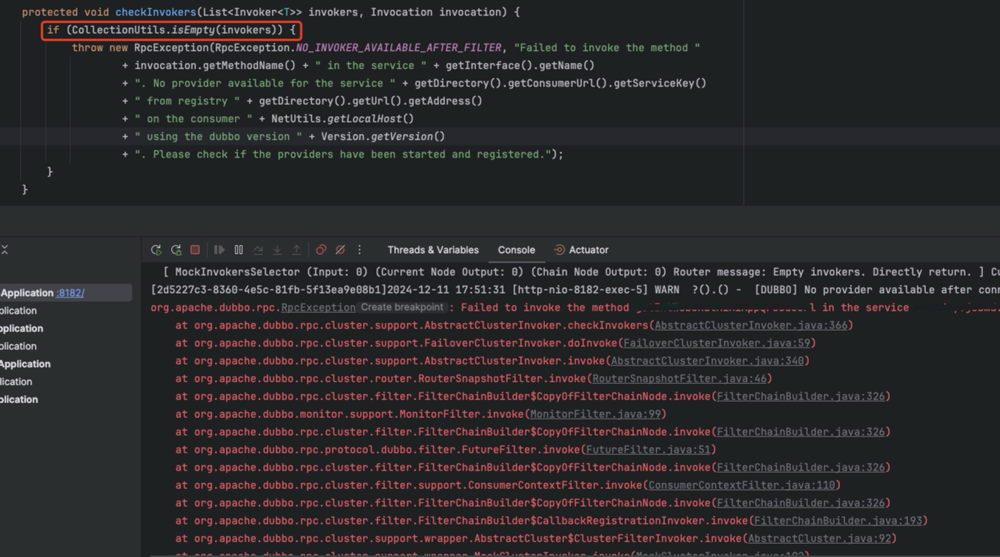

本地启动微服务项目开发时，偶尔会出现以下类似问题：

根据堆栈信息，我们可以看到是服务对应的 invokers 为空。这是什么原因导致的呢？

通过日志我们可以看到：

说明在 ServiceInstancesChangedListener#addListenerAndNotify 此处没有成功创建 invoker

那说明可能是 getAddress 方法返回的 urls 为空，进入该方法我们可以看到如果 urls 为空，很有可能是 serviceUrls 中获取不到当前服务相关的 urls

那么 serviceUrls 的值是哪里维护的呢？
其是在 ServiceInstancesChangedListener#doOnEvent 中进行赋值的，当服务实例发生变更时，会拉取所有实例的 meta 信息，然后聚合，最终赋值给 serviceUrls 字段。

那么什么时候 serviceUrls 不包含对应服务的 url 呢？
有一种情况是获取该服务所在的应用实例失败，无法获取应用的 meta 信息，自然聚合的 urls 不包括对应服务的 url 了。

在此处获取应用实例失败的原因是在 zookeeper 中获取对应路径下的应用失败：

具体为什么 zk 获取应用实例失败的原因还在排查中。
