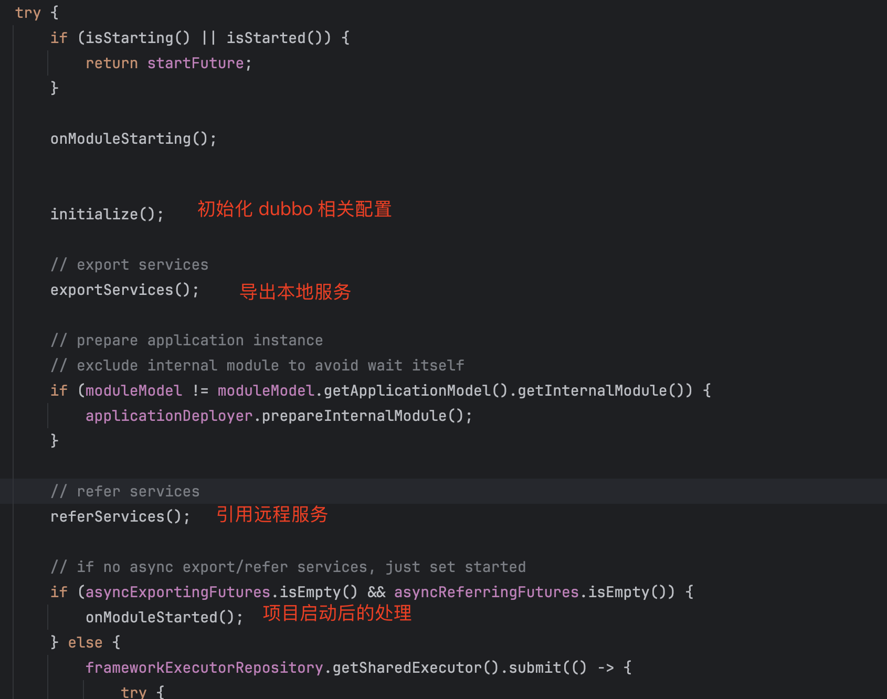

dubbo 服务导出过程：
1. 本地导出
   1. 创建本地 InjvmInvoker
   2. 创建本地 InjvmExport（Export 接口用于获取 invoker）
3. 远程导出
   4. dubbo 导出
      5. 创建 netty 服务
   6. 注册服务到远程中
      7. 应用级注册，只将 service 添加到 metaInfo 中
      8. 接口级注册，将 service 写到注册中心中（如：zk 创建对应子路径）
9. 暴露服务实例

接下来我们来阅读相关源代码了解服务导出的实现细节：
入口还是在 DefaultModuleDeployer#start 方法：

DefaultModuleDeployer#exportServices -> DefaultModuleDeployer#exportServiceInternal -> ServiceConfig#export -> ServiceConfig#doExport -> ServiceConfig#doExportUrls -> ServiceConfig#doExportUrlsFor1Protocol -> ServiceConfig#exportUrl

本地、远程导出的逻辑都是一样的：
- 创建 invoker
- 导出服务

区别在于根据传入 url 的协议，其导出逻辑会有所不同：
- injvm 协议，本地记录 invoker
- service-discovery-registry 应用级注册，只将 service 添加到 metaInfo 中
- registry 接口级注册，将 service 写到注册中心中

先介绍下如何创建 invoker：
invoker 主要是通过 JavassistProxyFactory#getInvoker 方法创建：

wrapper 类的部分源代码如下：

本地导出：

ServiceConfig#doExportUrl -> ServiceConfig#doExportUrl -> InjvmProtocol#export

远程导出：
ServiceConfig#doExportUrl -> RegistryProtocol#export

协议导出：
RegistryProtocol#doLocalExport -> DubboProtocol#export

url 注册到注册中心：

