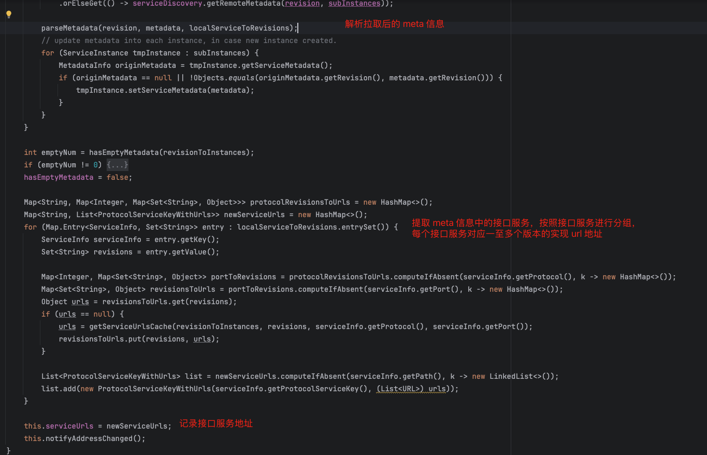
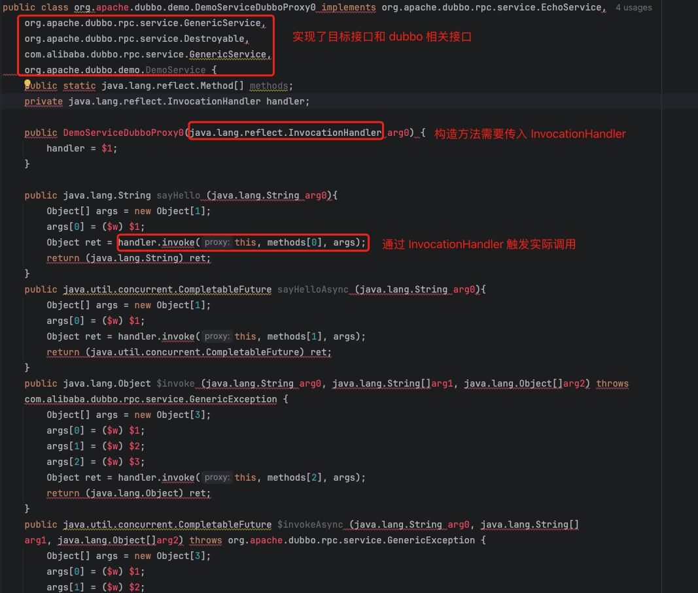

dubbo consumer 端启动时需要获取 dubbo provider 提供的服务地址，并且监听该地址的变化，同时建立底层通讯连接用于后续的 rpc 调用。接下来我们将阅读相关代码，了解 dubbo 的实现细节：

dubbo consumer 也是从 DefaultModuleDeployer#start 方法为入口开始服务的引用：

在 referenceService 开始引用远程服务，通过以下堆栈开始创建依赖服务的本地代理对象：
ReferenceConfig#get -> ReferenceConfig#get -> ReferenceConfig#init -> ReferenceConfig#createProxy

<u>Invoker 在 dubbo 中代表一个服务调用者，其内部通过调用 Client 模板，完成与服务端的通讯。</u>

继续进入 ReferenceConfig#createInvokerForRemote 方法：

RegistryProtocol#interceptInvoker -> MigrationRuleListener#onRefer -> MigrationRuleHandler#doMigrate -> MigrationRuleHandler#refreshInvoker

由于后续都会迁移到 register-mode: instance 模式，所以我们主要阅读 migrationInvoker.migrateToForceApplicationInvoker 方法逻辑：

MigrationInvoker#migrateToForceApplicationInvoker -> MigrationInvoker#refreshServiceDiscoveryInvoker

此处 serviceDiscoveryInvoker 为 ClusterInvoker 实例，ClusterInvoker 类用于实现容错，其内容通过 Directory 类保存多个 Invoker。在运行时通过负载均衡、路由等获取实际执行的 Invoker 进行 rpc 调用。

InterfaceCompatibleRegistryProtocol#getServiceDiscoveryInvoker -> RegistryProtocol#doCreateInvoker

ServiceDiscoveryRegistryDirectory#subscribe -> DynamicDirectory#subscribe -> ServiceDiscoveryRegistry#subscribe -> ServiceDiscoveryRegistry#doSubscribe -> ServiceDiscoveryRegistry#subscribeURLs

根据服务实例获取对应的 meta 信息

serviceInstancesChangedListener#addListenerAndNotify -> serviceDiscoveryRegistryDirectory#notify

触发 serviceDiscoveryRegistryDirectory#notify 方法，用于刷新 directory 中的 invoker 对象

获取 invoker 流程到此就结束了，接下来是根据 invoker 创建代理对象：

proxyFactory 默认实现为 JavassistProxyFactory， `proxyFactory.getProxy` 方法逻辑为：

如何根据接口创建 Proxy 类呢？主要是通过 ClassGenerator 类根据接口定义拼接出 Proxy 类的源代码，然后调用 Javassist 包创建对应的 Proxy class。拼接出来的 Proxy 类源代码如下：

InvokerInvocationHandler#invoke 方法使用是通过内部持有的 invoker 发起对应的 rpc 调用

